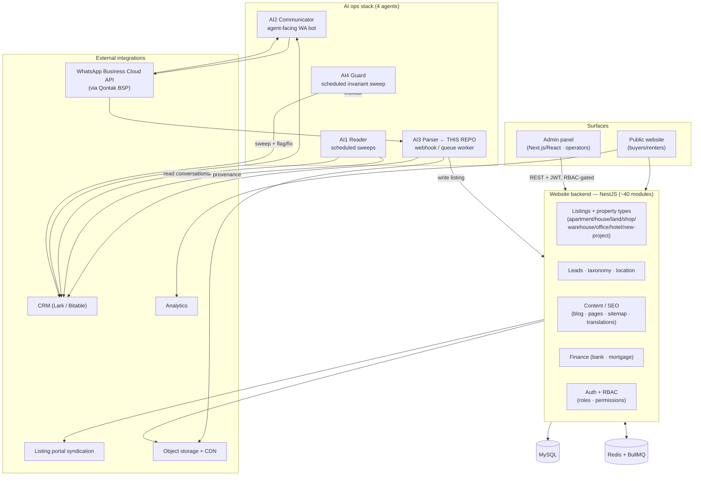

# System Architecture (full scope)

*A sanitized portfolio map of the broader system this repo's AI3 slice belongs
to. It names no company, contains no real phone numbers, agent names, CRM base
IDs, credentials, or internal identifiers — architecture level only. The only
**runnable** part is the AI3 listing parser in this repo; everything else is
described for context and its source is private.*

---

## 1. Overview

A real-estate brokerage's operations platform. At its core is a **public website
backend** (NestJS, ~40 modules) that serves property listings across every
property type, plus leads, content/SEO, taxonomy, and finance — itself a
recreation of an older **PHP/Laravel** backend. An **admin panel** (Next.js/React)
is the operator UI on top of it, gated by a role/permission system. Layered over
that is an **AI ops stack of four cooperating agents** — a reader, a communicator,
a listing **parser** (the slice in this repo), and a guard — that automate the
human-in-the-loop work of keeping listings and client conversations current. The
system talks to the outside world through WhatsApp (official Business API), a
CRM, a listing-portal syndication feed, and object storage/CDN.

---

## 2. Components

**Public website backend (NestJS, ~40 modules).** The system of record for the
public site: listings stored via a **polymorphic** `listingable` relation across
property types (apartment + unit, house, land, shop, warehouse, office +
building, hotel, business, new-project + unit), plus leads (listing / mortgage /
general), content & SEO (blog, pages, sitemap, per-language **translations** that
drive public URLs/slugs), taxonomy, location, finance (bank, mortgage), media,
and auth/RBAC. ~45 data models. It is a recreation of an older PHP/Laravel backend
(§3).

**Admin panel (Next.js / React).** The operator UI — Next.js (App Router) + React
with Ant Design, fetching over **REST** (axios + SWR) against the backend, with
JWT auth and route protection in middleware. Its UI is gated by the **same
role/permission model** the backend enforces, so what an operator can see and do
mirrors their server-side permissions rather than duplicating a separate access
model.

**AI ops stack — four agents, distinct triggers:**

- **AI1 — Reader** *(scheduled; runs on a reasoning-heavy model).* Sweeps agent
  conversation history a couple of times a day, derives each client's lead status,
  stage, and follow-up alerts, and writes those structured fields to the CRM. It
  is **read-only on WhatsApp** and queues real-world events (a showing happened,
  a message went unanswered) for confirmation rather than writing them blindly.
- **AI2 — Communicator** *(scheduled + webhook; agentic).* The agent-facing
  WhatsApp bot on a dedicated line. It runs the **24-hour-window engine** required
  by the official API (free-form messages only within 24h of an agent's last
  reply; a pre-approved template to re-open the window otherwise), sends
  morning/evening nudges, parses agent replies, creates activity records on
  confirmation, and answers Q&A from layered sources. A safety guard restricts it
  to whitelisted internal agent numbers.
- **AI3 — Parser** *(webhook / queue worker; this repo).* Turns a free-form
  listing broadcast into ~15 validated fields and writes the listing to the
  website DB and the CRM, with chat-history-before-record provenance, idempotent
  republish, and cheap→strong **model escalation**. Deep dive:
  [CASE_STUDY.md](CASE_STUDY.md).
- **AI4 — Guard** *(scheduled).* A daily **invariant sweep** over the data —
  duplicate property+unit, listing-ID/link consistency, role-conflict rules, WA
  records missing their chat history, prices out of bounds, dangling scheduled
  items. It **auto-fixes only the safe, reversible classes** (each with a
  snapshot + canary + post-verify) and flags everything that needs human judgment.
  It also watches pipeline health and cost, with email as the primary alert
  channel. AI4 is the outer backstop for the same invariants AI3 enforces inline.

**External integrations.** **WhatsApp** via the official Business Cloud API
through **Qontak** (a BSP gateway) — ToS-compliant, with no scraped channel; a
**CRM** (Lark / Bitable) holding contacts, listings, and the chat-history "birth
certificate" field; **listing-portal** syndication (a one-way export to an
external property listing portal); **object storage + CDN** for listing media; and **web
analytics**. Only product names and integration shapes appear here — no base IDs,
channel IDs, numbers, or credentials.

---

## 3. The PHP → NestJS recreation

The website backend was rebuilt from an older **Laravel 10 / PHP 8.3** application
(~42 Eloquent models, ~28 REST resource controllers, `spatie/laravel-permission`
for access control).

- **Ported as-is (shape preserved):** the ~40 domain areas; the **RBAC model**
  (roles + permissions + the join tables), so existing roles carried over rather
  than being redesigned; the **polymorphic** listing/media/taxonomy relations; and
  the per-language **translations** that back public URLs.
- **Added (new in the NestJS era):** the entire **AI layer** (reader,
  communicator, parser, guard) and its integrations (CRM sync, WhatsApp ingestion,
  portal syndication, a BullMQ/Redis queue tier) — none of which existed in the
  PHP app.
- **Two non-obvious migration decisions:**
  1. **Keep Laravel's morph-string convention in the database.** The polymorphic
     type column stores Laravel-style class strings (e.g. `App\Models\ApartmentUnit`).
     The NestJS/Prisma code writes those same strings rather than a cleaner enum,
     so the existing data — and anything still reading it — stays compatible. A
     "nicer" representation would have been a migration risk for zero user-visible
     gain.
  2. **Public URLs read slugs from the translations table, not the listing row.**
     Multi-language SEO lives in `translations` (id/en), so a title or
     tower-name correction is a *translations* sync (and a cache purge), not a
     single-row update — an easy invariant to get wrong if you assume the slug
     lives on the listing.

---

## 4. Cross-cutting decisions

- **RBAC / permissions.** One permission model, enforced server-side (guards) and
  mirrored in the admin UI — the frontend never invents its own access rules.
- **Idempotency as a default.** The parser keys listings by content so republish
  is an update, not a duplicate; the guard independently sweeps for duplicates —
  defense in depth on the same invariant from two directions (inline + audit).
- **Scheduled vs event-driven orchestration.** Reader and guard run on **cron
  sweeps** (batch, twice-daily / daily); the communicator is **schedule + webhook**;
  the parser is **webhook/queue**. Splitting by trigger keeps the batch
  reasoning work off the latency-sensitive ingestion path.
- **Observability.** Each agent emits a run report (message / extraction / anomaly
  / token counts, per-account connection state); the guard turns invariant
  violations into human-readable email alerts as the primary channel, with the
  WhatsApp bot as a secondary path.

---

## 5. What's runnable here vs described

| Area | Status in this repo |
|------|---------------------|
| **AI3 listing parser** (parse · validate · model escalation · invariants · eval · demo) | **Runnable** — `npm run demo` / `npm run eval` / `npm test`; see [CASE_STUDY.md](CASE_STUDY.md) and `backend/src/core/`, `backend/src/modules/{ai,whatsapp}` |
| Website backend (~40 modules, ~45 models) | Described only — source private |
| Admin panel (Next.js/React) | Described only — source private |
| AI1 Reader / AI2 Communicator / AI4 Guard | Described only — source private |
| Live integrations (WhatsApp BSP, CRM, portal, CDN, analytics) | Described only; represented in this repo as interfaces + an in-memory write-target |

The point of this document is breadth — to show the system I actually owned —
without bloating the showcase code. The depth, and the only code you can run, is
the AI3 slice.
