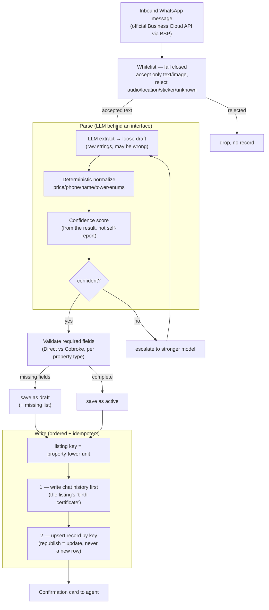

# A WhatsApp Listing Parser You Can Trust in a Write Path

*Case study. The production system processes live broker data and is private; this
document describes the architecture and engineering decisions. The runnable
companion in this repo is the listing-parser slice — parser, validation, model
escalation, and the correctness eval — with fabricated fixtures and no live keys.*

> **TL;DR (~5-min read).** Property agents submit listings as free-form,
> bilingual (Indonesian/English) WhatsApp broadcasts. This parser turns each one
> into a structured, validated listing written to a website database and a CRM —
> without letting a non-deterministic model corrupt the data.
> - **What it is:** one of several cooperating agents in a brokerage's ops stack
>   (reader, communicator, **parser ← this**, guard — see
>   [ARCHITECTURE.md](ARCHITECTURE.md)). This parser owns the listing write-path.
> - **The thesis:** the hard part isn't "call an LLM to extract fields." It's
>   *measuring* correctness, *validating* the model instead of trusting it,
>   spending the expensive model *only when it changes the answer*, and enforcing
>   *invariants* that make a flaky model safe to put in front of a database.
> - **Honest about it:** the eval proves **pipeline** correctness deterministically
>   (a fake LLM); judging live extraction *accuracy* would need a labeled set I
>   don't have (§5, §7). The WhatsApp channel is the official Business Cloud API
>   via a BSP, not a scraped one (§6).

---

## 1. Problem & context

A real-estate brokerage's agents already live in WhatsApp. The fastest way to get
a new listing into the system is to let them paste what they'd type anyway:

```
Dijual cepat apt pakview tower Redwood unit 12B, 2BR 1KM LB 80,
6.3M nego furnished, owner Bu Sari 08129xxxxxx direct
```

One line, and almost every field is a small parsing trap:

- **Bilingual & abbreviated.** `apt` = apartemen, `LB` = building area, `2BR` =
  bedrooms, `KM` = bathrooms, mixed Indonesian/English in the same sentence.
- **Shorthand building names.** `pakview` is an agent's nickname for a specific
  apartment; the system needs the canonical name to match the right parent record.
- **Local price magnitudes.** `6.3M` means 6.3 **billion** rupiah, not million.
  Mis-read the magnitude and you publish a listing priced 1000× off.
- **Owner identity packed into the text.** `owner Bu Sari 08129…` — a name with a
  stripped honorific and a phone number that must collapse to one canonical key
  whether written `08…`, `+62…`, or `62…`.

That free text then has to become a **trustworthy** structured record in two
systems of record at once (a website DB and a CRM), with an audit trail, and
without ever creating a duplicate or a half-row. The acceptance bar the
production system holds this parser to is blunt and measurable:

> **double-create = 0 · record-without-chat-history = 0 · post-write field
> mismatch = 0**, sustained for 7 consecutive days.

When I picked up the integrity work, double-creates were actively happening — the
"don't corrupt data" track was the one that was bleeding, so it went first.

---

## 2. Where this parser sits

This service is the **parser** in a four-agent stack: a **reader** (scheduled,
derives lead status from conversation history), a **communicator** (runs the
agent-facing WhatsApp bot inside Meta's 24-hour messaging window), the **parser**
itself (this case study), and a **guard** (scheduled, sweeps the data for invariant
violations and fixes the safe ones). The full system — and the PHP→NestJS recreation
it grew out of — is in [ARCHITECTURE.md](ARCHITECTURE.md). This document stays on
the parser.

---

## 3. Parser architecture

The pipeline is deliberately a straight line of small, individually-tested units.
Each box below is a function with its own test; the orchestrator holds no business
logic of its own (which is the whole point — see §8 on the god-processor it replaced).



`whitelist → parse(with escalation) → validate → write(history-before-record,
idempotent)`. Everything except the LLM call is deterministic and tested offline.

### Fullstack surface — playground, REST, Swagger

The same pipeline is exposed three ways so it's inspectable, not just describable:

- **A NestJS REST API** — `POST /api/listings/parse`, `GET /api/listings`,
  `GET /api/listings/:id` — a thin controller over the core pipeline, with a
  validated request DTO and an OpenAPI spec served at `/api/docs` (Swagger). The
  parser runs on the deterministic fake unless an LLM key is set, so the endpoints
  serve with no database or network.
- **A Next.js + React playground** (`/parse`) — paste a broadcast (or click a
  fabricated sample) and the structured result renders field-by-field, with a
  badge for the **model tier** that handled it, a **confidence** meter, and either
  the missing-field list or the rejection reason. It makes the cost/accuracy
  escalation and the validation gates *visible*: a clean template stays on the
  cheap tier; a messy free-form message visibly escalates.
- **A listings view** (`/listings`) backed by `GET /api/listings`, showing seeded
  fabricated rows plus anything parsed in the session.

The point of the UI isn't polish for its own sake — it turns "the pipeline
escalates models and validates before writing" from a sentence into something a
reviewer can drive in 30 seconds. The whole stack runs offline with one command
per half (see the repo README).

---

## 4. Key engineering & AI decisions

**The model proposes; deterministic code disposes.** The LLM returns a *loose
draft* — every field a raw string, allowed to be wrong. Then deterministic
extractors turn it into a typed record: `parsePrice("6.3M")` → `6_300_000_000`,
phones → one canonical `62…` key, conditions/types → closed enums, towers split
out of names. A price magnitude wrong by 1000× is the kind of error that must
**never** depend on model temperature, so that arithmetic lives in unit-tested
code, not in the prompt. This is the load-bearing AI decision: treat the model as
a fuzzy front-end to a strict parser, not as the parser.

**Confidence-based model escalation (the cost ↔ accuracy lever).** Most listings
are clean template messages a cheap model parses perfectly; a minority are messy
free-form prose. Paying top-tier model prices for *all* of them is waste; using
the cheap model on the messy ones is errors. So the parser starts cheap, **scores
confidence from the normalized result** (not the model's self-reported
confidence, which models are bad at), and escalates to a stronger model only when
the score is low. In production this is a `mini → full` step within one provider
family; in this repo it's a provider-neutral `cheap → mid → strong` ladder behind
a `ListingLlmClient` interface.

| Tier | Handles | Cost |
|------|---------|------|
| `cheap` | clean template messages (the majority) | lowest |
| `mid` | messy free-form prose | medium |
| `strong` | genuinely ambiguous / conflicting | highest |

```
# npm run demo  (deterministic fake LLM — fabricated message)
model tier: mid   escalation: cheap:0.00 → mid:1.00
confidence: 1
■ WRITTEN
  Pakubuwono View · Tower Redwood · unit 12B
  Apartemen · Jual · Direct · price Rp 6.300.000.000 · 2BR/1KM · LB 80 · Furnished
```
*The cheap tier returns a thin parse on this messy message (confidence 0.00), so
the pipeline escalates one step and writes. Clean templates never escalate.
Fabricated data, illustrative.*

**Why not fine-tune, and why not pure rules.** Fine-tuning needs a labeled corpus
I don't have, and the building registry (which shorthand maps to which canonical
apartment) changes faster than a fine-tune cycle — a new tower is a one-line data
edit and a test, not a retraining run. Pure rules, conversely, drown in the
variety of free text (every agent abbreviates differently). The split that
actually fits: an LLM for the loose, high-variety extraction; a deterministic
alias table + extractors for the parts that must be exact and that evolve.

**Write-ordering invariant: chat history before the record.** A listing with no
record of the conversation that produced it is an unauditable orphan and a sign
the pipeline half-failed. So the writer persists the chat history first, verifies
it landed, and only then creates the record — and **refuses** to write a record
that has no history rather than create an orphan. The chat log is treated as the
listing's "birth certificate."

**Idempotent republish.** Identity is the listing's *content* — `(property,
tower, unit)` — not the row id the database assigns. The same broadcast re-sent,
or an alias-equivalent one (`pakview` vs *Pakubuwono View*), collapses onto the
same key, so republishing is an in-place update, never a duplicate row. This is
the direct fix for the double-create bug that was bleeding in production.

**Whitelist that fails closed.** Meta's webhook delivers *every* event type to one
endpoint — text, image, but also audio, location, stickers, reactions, and types
that don't exist yet. The safe default is to accept an explicit allowlist and
reject everything else, including malformed payloads and unknown future types, so
a shared location or a 👍 can't advance a conversation and create an empty record.

**Drafts, not dropped work.** An incomplete parse used to be discarded with an
"add the missing fields" prompt — but that throws away what the agent already
typed. Instead an incomplete listing is saved as a **draft** (with its missing
list) on the same history-first, idempotent write path, keyed by the same listing
identity. Editing it or re-sending it with the gaps filled flips it `draft →
active` in place — no duplicate. The invariant a flaky model must respect isn't
"don't save," it's "don't *publish* something incomplete": a draft never becomes
active while a required field is missing (eval gate 5).

---

## 5. Reliability & correctness — the eval is the centerpiece

The thing I'm proudest of here isn't a feature; it's that the system's correctness
is **runnable**. `npm run eval` executes fabricated fixtures through the real
pipeline and asserts five gates, printing a pass/fail report and exiting non-zero
on failure (so it doubles as a CI check):

| Gate | What it proves | Maps to production target |
|------|----------------|---------------------------|
| Parsed fields match source | the structured output reflects the message (price magnitude + currency/period, alias expansion, channel, owner, area) | post-write mismatch = 0 |
| Republish does **not** double-create | re-sending a broadcast updates one row, never inserts a duplicate | double-create = 0 |
| No record without chat history first | a write with no provenance is refused, not orphaned | record-without-chat = 0 |
| Whitelist fails closed | audio/location/sticker/unknown/malformed are rejected, never processed | the phantom-record defense |
| A draft never becomes active while incomplete | an incomplete parse is saved as a draft, never published as active until complete | "don't publish a half-listing" |

The first three gates map one-to-one onto the production acceptance criteria
(double-create = 0 · record-without-chat = 0 · mismatch = 0). 97 unit tests cover
the extractors and each invariant; the eval composes them end-to-end.

**The honest boundary.** This eval proves the **pipeline** is correct
*deterministically* — it runs against a fake LLM, so the same input always
produces the same parse and the gates are reproducible in CI with no network.
What it does **not** measure is live-model **extraction accuracy** on real messy
text — "did the model read `6.3M` as 6.3 billion on this never-seen message." That
needs a labeled evaluation set (human-graded message → expected fields), which is
the first thing I'd build to put a number on accuracy (§9). I'm careful not to
claim the deterministic gates say anything about model quality; they say the
plumbing around the model is sound.

---

## 6. Privacy & data handling

The production system reads real agent–client conversations, so sensitivity is a
design constraint, not a footnote — and this public repo is treated as a
release-controlled artifact:

- **Scope & channel.** Listings arrive on **company-issued** agent lines over the
  **official WhatsApp Business Cloud API** (through a BSP gateway), not a scraped
  or reverse-engineered protocol. Outbound stays within Meta's rules (§ the
  communicator agent in ARCHITECTURE.md owns the 24-hour-window logic).
- **This repo is sanitized.** No company name, no real agent names, phone numbers,
  building/listing identifiers, CRM base IDs, domains, or credentials. Every
  fixture, owner, and phone number in the code and in this document is
  **fabricated**; `.env.example` is placeholders only; secrets are git-ignored.
  History was scanned (gitleaks + targeted identifier grep) before publishing.
- **Provenance over convenience.** The chat-history-before-record invariant exists
  partly so every published listing is auditable back to the message and agent
  that created it.

---

## 7. LLM tradeoffs, stated plainly

- **Hallucination.** A model can confidently invent a price or a unit. Mitigation
  is structural, not hopeful: the model's output is a draft that must survive
  deterministic parsing and field validation before anything is written, and a
  post-write verify checks the record matches the parse.
- **Cost.** Every parse is at least one model call; escalation adds a second on
  the messy minority. The escalation ladder exists precisely to keep the expensive
  model off the easy majority.
- **Latency.** Escalation trades latency for accuracy on hard messages (a second
  round-trip). Acceptable here because listing creation is asynchronous (a queue
  worker, not a user blocking on a response).
- **Non-determinism.** The same message can parse differently run-to-run. The
  deterministic normalizers downstream absorb most of it, and the eval pins the
  *pipeline's* behavior with a fake model so regressions are caught without
  chasing model variance.

---

## 8. Selected hard problems

- **Getting price magnitude right, deterministically.** `4.5M`, `4,5 miliar`,
  `25jt`, `Rp 1.500.000.000`, `@41jt/bulan nego` — all parsed by tested code with
  an explicit guard that returns *null* on genuinely ambiguous tokens rather than
  guessing (a wrong number is worse than a "please clarify").
- **Composing write-order + idempotency correctly.** The invariant isn't one
  check; it's an ordering (history → verify → record) keyed on derived content so
  that republish, alias-equivalence, and "no orphan" all fall out of the same
  small writer. Getting that composition right is what makes the three gates
  hold together rather than individually.
- **Decomposing a 600-line god-processor.** The original WhatsApp handler was one
  large, stateful, untested file — exactly the shape that reads as
  machine-generated and hides bugs. The public slice rebuilds it as small,
  individually-tested units behind a thin orchestrator; an untested god-file is a
  liability I deliberately chose not to ship.
- **Failing closed on an open-world input.** WhatsApp's event surface grows over
  time; the whitelist is the one place where "reject anything I don't explicitly
  understand" is the correct instinct, and wiring that default was a one-line
  change with an outsized blast-radius reduction.

---

## 9. What I'd do differently / next

- **A labeled extraction-accuracy eval.** Human-grade a few hundred real messages
  to expected fields and score live-model accuracy (and per-tier accuracy, to tune
  the escalation threshold on data instead of intuition). This is the gap §5 is
  honest about.
- **Wire the public slice to a real store.** The runnable repo writes to an
  in-memory target to stay dependency-free; the production path writes to the
  website DB + CRM. A thin persistent adapter would let the demo show the full
  write without standing up infrastructure.
- **Multi-turn clarification.** When a field is missing or low-confidence, ask one
  targeted question rather than rejecting — the production flow does some of this;
  the slice keeps it minimal.
- **Observability on the escalation rate.** Track what fraction of messages
  escalate and why; a rising escalation rate is an early signal that input quality
  (or a model) shifted.

---

### Stack

TypeScript · NestJS · Prisma (MySQL) · BullMQ/Redis · OpenAI SDK behind a
`ListingLlmClient` interface (deterministic fake for tests/eval/demo) · Jest. In
production the parser runs as a queue worker consuming the official WhatsApp
Business Cloud API via a BSP gateway and writing to a website DB and a CRM.

— Runnable companion: this repo's [`README.md`](README.md) ·
broader system: [`ARCHITECTURE.md`](ARCHITECTURE.md).
