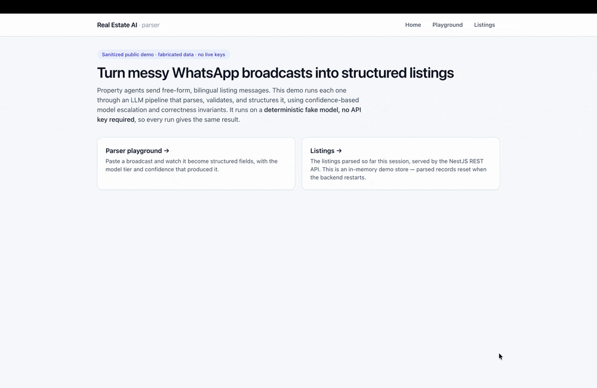

# Real Estate AI — Fullstack WhatsApp Listing Parser

[](https://github.com/kaylaelishevaa/real-estate-ai-platform/actions/workflows/ci.yml)

**[▶ Try the live demo](https://honest-balance-production.up.railway.app/parse)** · [Swagger API](https://real-estate-ai-platform-production.up.railway.app/api/docs)

> Runs on a free tier, so the first request may cold-start for ~15–30s.



> A **sanitized public extract** of a private production system. Property agents
> submit listings as free-form WhatsApp broadcasts; an LLM pipeline turns them
> into structured, validated records written to a website DB and a CRM. All
> names, buildings, phones, and credentials here are fabricated.

A fullstack monorepo: a **Next.js + React playground** to paste a broadcast and
watch it become structured fields in real time, a **NestJS REST API** (with
Swagger) over the parser, and a framework-agnostic, fully-tested **core pipeline**.
The whole thing runs with **no database, no network, and no API key** — the LLM
sits behind an interface with a deterministic fake.

The interesting part isn't "call an LLM to extract fields." It's everything that
makes an LLM safe to put in a write path: **measuring** correctness, **validating**
the model's output instead of trusting it, spending the **expensive model only
when it changes the answer**, and enforcing **invariants** that stop a flaky model
from corrupting data.

---

## System context

This repo is the runnable slice. Three companion docs give it depth and breadth:

- **[CASE_STUDY.md](CASE_STUDY.md)** — the listing-parser deep dive: the AI
  decisions, the model-escalation tradeoff, and why the correctness eval is the
  centerpiece.
- **[ARCHITECTURE.md](ARCHITECTURE.md)** — the full-system map: a ~40-module
  NestJS backend (recreated from PHP/Laravel), an admin panel, and a multi-agent
  AI ops stack. The listing parser in this repo is one of those agents.
- **[MIGRATION_CASE_STUDY.md](MIGRATION_CASE_STUDY.md)** — the zero-downtime
  Laravel/PHP → NestJS migration of the live platform: the schema-adoption call,
  the production-ops discipline, and the AI/portal incidents, told honestly.

---

## The problem

A listing arrives as a message like:

```
Dijual cepat apt pakview tower Redwood unit 12B, 2BR 1KM LB 80,
6.3M nego furnished, owner Bu Sari 081299990001 direct
```

Bilingual (Indonesian/English), abbreviated (`apt`, `LB`, `2BR`), shorthand
building names (`pakview` → *Pakubuwono View*), prices in local magnitudes
(`6.3M` = 6.3 **billion** rupiah, not million), and a phone number that must
match the same owner whether written `0812…`, `+62 812…`, or `62812…`.

Get the price magnitude wrong and you publish a listing off by 1000×. Let an
unhandled message type through and you create an empty "phantom" record.
Re-process the same broadcast and you create a duplicate. This repo is about
**not doing those things**, provably.

---

## Architecture

```
 Browser                     HTTP / JSON                 In-process
┌──────────────┐   POST /api/listings/parse   ┌────────────────────────────┐
│ Next.js +    │ ───────────────────────────▶ │ NestJS REST API            │
│ React UI     │   GET  /api/listings         │ (Swagger at /api/docs)     │
│ (playground) │ ◀─────────────────────────── │        │                   │
└──────────────┘     { success, data }        │        ▼                   │
                                               │ core pipeline (src/core)   │
                                               │ whitelist → parse(escalate)│
                                               │  → validate → write        │
                                               │        │                   │
                                               │        ▼                   │
                                               │ in-memory store + LLM seam │
                                               │ (deterministic fake LLM)   │
                                               └────────────────────────────┘
```

```
frontend/                Next.js (App Router) + React + Tailwind + SWR
  app/parse/             ← the parser playground (the centerpiece UI)
  app/listings/          ← table of parsed listings (GET /api/listings)
  components/ lib/        ← typed API client, tier badge, fields, tests (Vitest)

backend/
  src/core/              ← framework-agnostic, fully tested, no DB / no network
    extract/             ← deterministic parsers: price, phone, name, tower, enums
    llm/                 ← LLM behind an interface + deterministic fake + OpenAI adapter
    parse/               ← normalize → validate → confidence → model escalation
    intake/              ← whitelist (fails closed)
    store/ + invariants/ ← in-memory write-target, write-ordering, idempotency
    pipeline/            ← the slim orchestrator that composes the above
  src/modules/listings/  ← the REST surface the UI calls (parse / list / get)
  src/modules/           ← production NestJS extract (auth, queues, Prisma, security)
  eval/                  ← `npm run eval`: the correctness harness
  demo/                  ← `npm run demo`: one-command CLI parse
```

The **core** is the showcase: small, single-purpose, individually tested units.
The **NestJS layer** exposes it over REST and is the production scaffolding the
core was lifted from. The **frontend** is a thin, typed client over that API.

---

## Run it

Two terminals. Nothing else — no DB, Redis, or keys needed.

**1 — Backend API** (`http://localhost:4000`, Swagger at `/api/docs`):

```bash
cd backend
cp .env.example .env      # placeholder values are fine for the demo
npm install
npm run start             # or: npm run start:dev
```

**2 — Frontend** (`http://localhost:3000`):

```bash
cd frontend
cp .env.example .env      # NEXT_PUBLIC_API_URL=http://localhost:4000/api
npm install
npm run dev
```

Open `http://localhost:3000/parse`, paste a broadcast (or click a sample), and
watch it parse. Set `OPENAI_API_KEY` in `backend/.env` to use a live model
instead of the fake.

> **Note:** the listings view is an **in-memory demo store** — parsed records
> reset when the backend restarts (no database is involved). That's intentional
> for a zero-infra demo; the production system this was extracted from persists to
> MySQL + a CRM.

| Env var | Where | Default | Purpose |
|---------|-------|---------|---------|
| `NEXT_PUBLIC_API_URL` | frontend | `http://localhost:4000/api` | Backend base URL |
| `WEB_ORIGIN` | backend | `http://localhost:3000` | CORS origin for the UI |
| `OPENAI_API_KEY` | backend | _(unset → fake LLM)_ | Optional: live model |

> **Screenshots:** _(add `docs/img/playground.png` and `docs/img/listings.png` here)_

### CLI demo / eval / tests (no servers)

```bash
cd backend
npm run demo     # parse fabricated broadcasts, print listing + model tier
npm run eval     # the correctness gates (pass/fail report)
npm test         # 97 backend unit tests

cd ../frontend
npm test         # 9 component tests (Vitest + React Testing Library)
```

`npm run demo` output:

```
model tier: mid   escalation: cheap:0.00 → mid:1.00
confidence: 1
■ WRITTEN
  Pakubuwono View · Tower Redwood · unit 12B
  Apartemen · Jual · Direct
  price Rp 6.300.000.000
  2BR / 1KM · LB 80 · LT — · Furnished
  owner Sari 6281299990001
```

The cheap model returns a thin parse on this messy free-form message (confidence
0.00), so the pipeline escalates to a stronger model that resolves it, then
writes. A clean template message is handled by the cheap model alone.

---

## The measurement: `npm run eval`

> *"I measure my LLM system's correctness"* is the rarest, highest-value signal
> for an AI role — so it's the centerpiece here.

`eval/run-eval.ts` runs fabricated fixtures through the real pipeline and asserts
five correctness gates, printing a pass/fail report and exiting non-zero on any
failure (so it doubles as a CI check):

| Gate | What it proves |
|------|----------------|
| **1. Parsed fields match source** | The structured output reflects the message — price magnitudes, currency (IDR/USD + rent period), alias expansion, channel, owner, area. |
| **2. Republish does not double-create** | Re-sending the same broadcast updates one row; it never inserts a duplicate. |
| **3. No record without chat history first** | Every listing is written *after* its provenance; a write with no history is refused, not orphaned. |
| **4. Whitelist fails closed** | Audio / location / sticker / unknown / malformed messages are rejected, never silently processed. |
| **5. A draft never becomes active while incomplete** | An incomplete parse is saved as a `draft` (not discarded); it only flips to `active` once every required field is present. |

---

## Design decisions (the *why*)

### 1. Validate — don't trust — the LLM
The model returns a **loose draft** (`RawListingDraft`). Deterministic code then
parses every field into a typed `ParsedListing`: `parseMoney("6.3M")` →
4.5 billion rupiah, `parseMoney("USD 2,300/month")` → `{ 2300, USD, month }`,
phones → one canonical key, conditions/types → closed enums. Getting a price
wrong by 1000× — or silently dropping a USD rent — must never depend on model
temperature, so that math lives in unit-tested code, not the prompt.
→ `core/parse/normalize-listing.ts`, `core/extract/*`

### 2. Confidence-based model escalation (cost ↔ accuracy)
Most listings are clean template messages a cheap model parses perfectly. Paying
the top-tier price for all of them is waste; using the cheap model on the messy
10% is errors. So we start cheap, **score confidence from the normalized result**
(not the model's self-report), and escalate only when it's low.

| Tier | Handles | Cost |
|------|---------|------|
| `cheap` | clean template messages (the majority) | lowest |
| `mid` | messy free-form prose | medium |
| `strong` | genuinely ambiguous / conflicting | highest |

The tiers are **provider-neutral**: the LLM sits behind a `ListingLlmClient`
interface, so the concrete model per tier lives in one adapter (an OpenAI adapter
is included; swapping providers is a single file). Tests, demo, and eval run on a
deterministic fake, so none of them depend on a live model.

→ `core/parse/confidence.ts`, `core/parse/model-escalation.ts`, `core/llm/`

### 3. Write-order invariant: history before record
A listing without the chat that produced it is an unauditable orphan and a sign
the pipeline half-failed. The writer persists provenance 
first, verifies it
landed, then creates the record — and **refuses** to write a record with no
history. → `core/invariants/write-order.ts`

### 4. Idempotent republish
Identity is the content `(property, tower, unit)`, not the DB row id. The same
broadcast — or an alias-equivalent one (`pakview` vs *Pakubuwono View*) —
collapses onto one record, so republishing is an in-place update, never a
duplicate. → `core/store/listing-key.ts`

### 5. Whitelist fails closed (the phantom-record fix)
Meta's webhook delivers *every* event type to one endpoint. The original bug
branched on known types and fell through on the rest, so a shared location or a
👍 reaction could advance a conversation and create an empty listing. The fix
accepts an explicit allowlist and rejects everything else — including malformed
payloads and message types that don't exist yet. → `core/intake/message-whitelist.ts`

### 6. Drafts are saved, but never *active* until complete
An incomplete parse isn't discarded — the agent's work would be lost. It's saved
as a **draft** (with the list of missing fields) on the same write path, keyed by
the same listing identity, so re-sending or editing the listing to fill the gaps
flips it `draft → active` **in place** — no duplicate. The line a flaky model
must never cross isn't "don't save," it's "don't *publish* something incomplete."
→ `core/pipeline/ingest-listing.ts`, eval gate 5.

---

## Tech

**Backend:** NestJS · TypeScript · Prisma (MySQL) · BullMQ/Redis · OpenAI SDK ·
`@nestjs/swagger` · Jest.
**Frontend:** Next.js (App Router) · React · TypeScript · Tailwind · SWR ·
Vitest + React Testing Library.

The parser core has zero framework or infrastructure dependencies, which is what
makes it testable — and the whole demo runnable — offline.

## Deliberately out of scope

This is a focused extract, not the whole platform. Property-type CRUD, blog/SEO,
dashboards, mortgage tooling, user/role management, and the multi-portal sync
internals exist in the production system but are omitted here to keep the signal
high. The Lark/CRM and portal integrations are represented as interfaces and a
minimal in-memory write-target rather than live clients.
